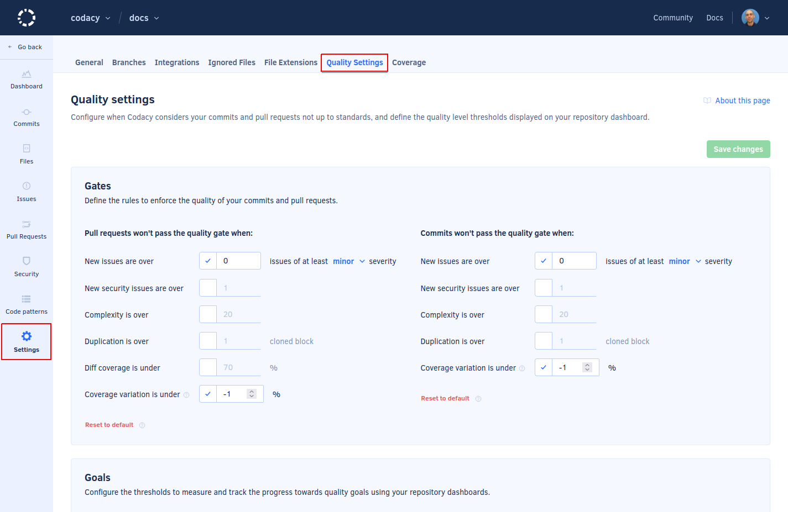

# Integrating Codacy with your Git workflow

Once you've [configured your repository](configuring-your-repository.md) to best match your use case, **integrate Codacy with your Git workflow** to display analysis results and code coverage on your Git provider and block problematic pull requests.

To integrate Codacy with your Git workflow, follow these steps:

1.  [Configuring quality settings](#configuring-quality-settings)
1.  [Activating the Git provider integration](#git-provider-integration)
1.  [Blocking merging pull requests](#blocking-pull-requests)

## 1. Configuring quality settings {: id="configuring-quality-settings"}

[Configure the quality settings](../repositories-configure/adjusting-quality-settings.md) of your project to define the gates (minimum acceptable values) and goals for quality metrics such as issues, duplication, complexity, and code coverage.

!!! info "Using code coverage as a quality gate"
    To use code coverage as a quality gate:

    -   Ensure that code coverage reports are being generated and uploaded to Codacy
    -   Enable **Diff coverage is under** or **Coverage variation is under** when configuring the quality settings

!!! tip
    Depending on the initial quality of your repositories and on your current team practices, the default gates may be too strict. Consider initially limiting gates to new critical issues, new security issues, and considerable drops in code coverage.

## 2. Activating the Git provider integration {: id="git-provider-integration"}

Activate the integration with your Git provider ([GitHub](../repositories-configure/integrations/github-integration.md), [GitLab](../repositories-configure/integrations/gitlab-integration.md), [Bitbucket](../repositories-configure/integrations/bitbucket-integration.md)) and enable the option **Status checks** (GitHub) or **Pull request status** (GitLab and Bitbucket). This instructs Codacy to report to your Git provider whether the status checks on a pull request are passing or failing, based on your quality settings.

## 3. Blocking merging pull requests {: id="blocking-pull-requests"}

Set up your Git provider to enforce Codacy's feedback and block merging pull requests with failing status checks ([GitHub](https://docs.github.com/en/repositories/configuring-branches-and-merges-in-your-repository/defining-the-mergeability-of-pull-requests/managing-a-branch-protection-rule), [GitLab](https://docs.gitlab.com/ee/user/project/merge_requests/merge_when_pipeline_succeeds.html#only-allow-merge-requests-to-be-merged-if-the-pipeline-succeeds), [Bitbucket](https://support.atlassian.com/bitbucket-cloud/docs/suggest-or-require-checks-before-a-merge/)).

## Next steps

**Congratulations!**  🎉 You've successfully integrated and set up your first repository.

Before moving on, it's important that you:

-   Validate that Codacy is reporting the intended status on your pull requests
-   Review your [tool and code pattern settings](../repositories-configure/configuring-code-patterns.md) and [quality gate settings](../repositories-configure/adjusting-quality-settings.md)

This is important to eliminate any false positives that could inadvertently block the work of your team.
