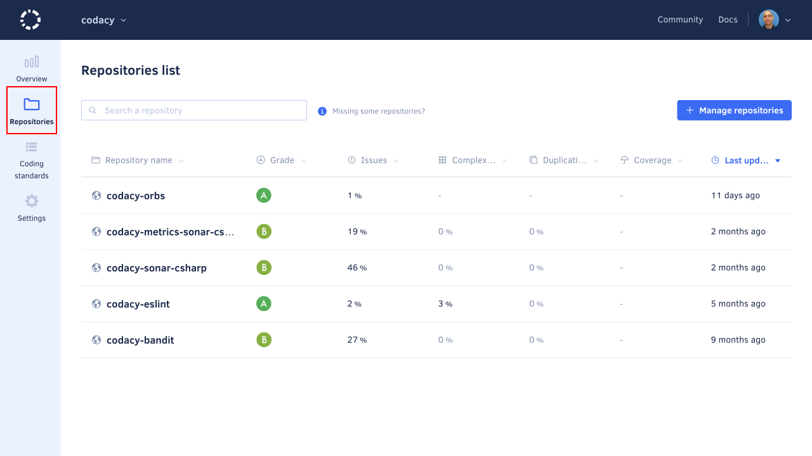
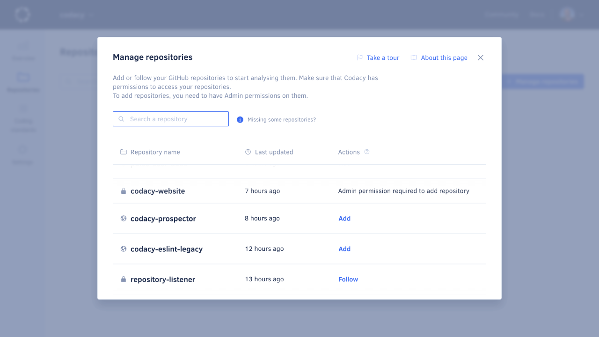

# Managing repositories

Users with the [necessary permissions on your Git provider](roles-and-permissions-for-organizations.md) can **add** repositories to Codacy to start analyzing them. The remaining organization members can then **follow** added repositories of their interest on Codacy.

To see a list of the repositories that you follow on Codacy, open the page **Repositories** under your organization. Across the application, Codacy calculates and displays data for the repositories in this list.

<!-- TODO PLUTO-368 Update screenshot -->

This page lists the repositories that you follow on Codacy sorted by [last updated date](organization-overview.md#last-updated-repositories), and allows you to compare the repositories in the list according to the following metrics:

-   [Grade](../faq/code-analysis/which-metrics-does-codacy-calculate.md#grade)
-   [Issues](../faq/code-analysis/which-metrics-does-codacy-calculate.md#issues)
-   [Complexity](../faq/code-analysis/which-metrics-does-codacy-calculate.md#complexity)
-   [Duplication](../faq/code-analysis/which-metrics-does-codacy-calculate.md#duplication)
-   [Coverage](../faq/code-analysis/which-metrics-does-codacy-calculate.md#code-coverage)

The list also displays error and warning messages for repositories that have issues, such as when there are no committers added to the organization or when Codacy stopped having access to the repository. Hover the mouse cursor over the warning icons or open the repository to see more details.

If you are following many repositories, you can use the search field above the list to quickly find a specific repository.

## Adding or following a repository {: id="adding-a-repository"}



Depending on your [permissions on the Git provider](roles-and-permissions-for-organizations.md) you can:

-   **Add** a new repository to Codacy to start analyzing it. You need admin permission over the repository to add it to Codacy.
-   **Follow** a repository that was already added to Codacy by a repository admin.

To add or follow a repository, click the button **Manage repositories** at the top right-hand corner of the page. This opens a window listing your organization repositories.

<!-- TODO PLUTO-368 Update screenshot -->

!!! important
    To see your repositories in this list, make sure that you have permissions over the repositories on the Git provider and that Codacy has permissions to access the repositories.

Add or follow your repositories by clicking **Add** or **Follow** next to the repositories. If you have many repositories, you can use the search field above the list to quickly find a specific repository.

Then, close the window to return to your repositories list. Although Codacy immediately starts analyzing newly added repositories, they display empty metrics until the first analysis returns results.

!!! note
    -   When an **admin user** adds a new repository to Codacy, all users with admin permissions over that repository start following it automatically.

    -   You automatically **start following** a repository as soon as you access any page from that repository. For example, when you access the repository using a direct link on your Git provider UI.

        Conversely, you automatically **stop following** a repository as soon as you try accessing any page from that repository but you don't have permissions to see that repository anymore.

## See also

-   [Which metrics does Codacy calculate?](../faq/code-analysis/which-metrics-does-codacy-calculate.md)
